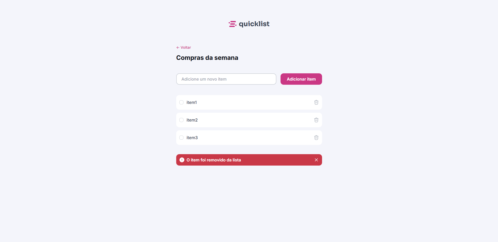

<h1 align="center"> ✅ Quicklist ✅</h1>

Projeto pessoal utilizando conceitos HTML, CSS e Javascript.

  <a href="#-tecnologias">Tecnologias</a>&nbsp;&nbsp;&nbsp;|&nbsp;&nbsp;&nbsp;
  <a href="#-projeto">Projeto</a>&nbsp;&nbsp;&nbsp;|&nbsp;&nbsp;&nbsp;
  <a href="#-layout">Layout</a>&nbsp;&nbsp;&nbsp;

 

  

## 🚀 Tecnologias

Esse projeto foi desenvolvido com as seguintes tecnologias:

-   HTML e CSS
-   Javascript
-   Git e GitHub
-   Figma

## 💻 Projeto

Quicklist é um sistema para gerenciar uma lista de compras, em que o usuário pode adicionar novos items na lista, checa-los e exclui-los. <a href="https://quicklist-tau.vercel.app/" target="_blank" rel="noopener noreferrer">aqui</a> para testar a página.

## 🎨 Layout

Clique <a href="https://www.figma.com/design/qa3C0VM4oaloF4qKNEDyNV/Lista-de-compras--Community-?node-id=3108-1350&t=xY0Eqhk8kMUFvE5Q-0">aqui</a> para conhecer a prototipagem do projeto.
 
 
 
 

Desenvolvido com ♥ by Mateus de Castro Macedo 👨‍💻

